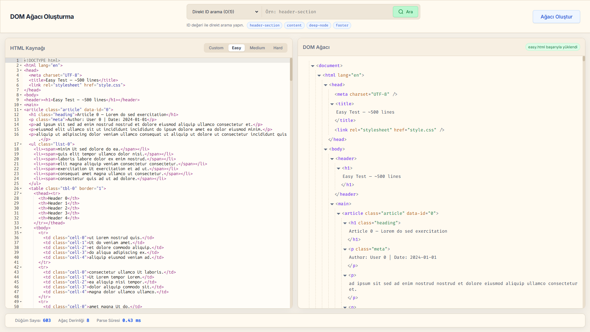
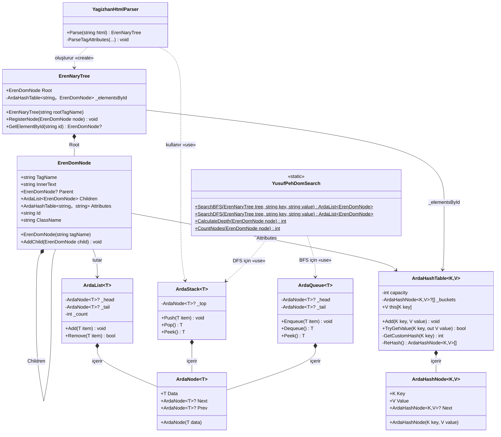

# HTML'den DOM Ağacı Oluşturma Projesi



---

<div align="center">
    <a href="https://drive.google.com/file/d/1wWZtfNdcsouVTxJyt3MQGJDn2ol1JsSO/view?usp=sharing"></a>
</div>

---

Bu proje, bir HTML stringini parse ederek DOM ağacı yapısı oluşturur. Projemiz 3 kısımdan oluşmaktadır.

### 1. Core (Çekirdek) katmanı
C#'taki hazır koleksiyonlar (`List<>`, `Dictionary<>` vb.) yerine kullandığımız kendi yazdığımız veri yapılarını, ağaç yapısını ve parser mantığını içerir.

Çekirdek katmanı .NET 8 ile yazılmıştır. Hiçbir dış kütüphane kullanmamaktadır.

### 2. API katmanı
Çekirdek ile web katmanının arasındaki iletişimi sağlar. Frontend'den gelen HTML stringini çekirdekteki parser'ı kullanarak ayrıştırır. Sonuçları HTTP üzerinden JSON formatında geri döndürür.

API katmanı .NET 8 Web API kullanmaktadır.

### 3. Web katmanı
Kullanıcının projeyle etkileşime geçeceği katmandır. Kullanıcı bir HTML stringi gönderip bu HTML'den oluşturulan DOM ağacını görebilir, bu ağaç üzerinde arama yapabilir.

## Oluşturduğumuz Veri Yapıları
Projemizde C#'ın hazır veri yapıları yerine kendi veri yapılarımızı oluşturup kullandık. Detaylarını aşağıda görebilirsiniz.

### 1. Ağaç yapısı (ErenDomNode ve ErenNaryTree)
- **ErenDomNode**: Ağaçtaki en küçük birimdir. Her bir node bir HTML dokümanındaki en küçük birim olan HTML elementlerini temsil eder. İçerisinde elementin adı, içindeki metni, bir üst seviyedeki elementi ve sahip olduğu attribute'ları barındıran tutan özel bir hash table barındırır. Altındaki diğer HTML elementlerini de bir ArdaList içinde saklar.

- **ErenNaryTree**: Ağacın kendisidir. Ağaç içindeki hiyerarşiyi yönetir. Altına sınırsız sayıda node alabilen kök düğümü (root) tutar.
Bir N-ary tree'de her düğümün N adet alt düğümü (çocuğu) olabilir. Ayrıca içinde `id` ile hızlı aramalar yapmak için bir hash table barındırır.

### 2. Dinamik dizi (ArdaList)
C#'taki standart liste yapısının elle yazılmış bir muadilidir. Çift yönlü bir bağlı liste mantığıyla oluşturulmuştur. Indexer yapısı sayesinde dinamik dizi gibi çalışır.

DOM node'larının alt node'larını listelemek ve arama sonuçlarını saklamak için kullanılır. Listeye eleman ekleme veya indeksten eleman getirme işlemlerini yönetir.

### 3. Hash Table (ArdaHashTable)
Elementlere hızlı erişebilmemiz için Key-Value (Anahtar-Değer) şeklinde saklayan veri yapısıdır. Projede iki farklı yerde kullanılır:

1. **ID İndeksi**: Ağaca eklenen ve bir ID'si olan her bir düğümü, id'yi anahtar (key) ve düğümün kendisini değer (value) olarak alıp hash table içinde indeksler. Aranan id'nin hash değeri hesaplanıp doğrudan ID'nin bulunduğu bucketa gidildiği için, ağaçta milyar tane bile düğüm olsa aradığımız düğüm O(1) zamanda yani neredeyse anında bulunur.
2. **Element Attribute'ları:** Her bir DOM düğümü kendi HTML attribute'larını (Örn: `class="container"`) hash table yapısı içinde tutar. Bu sayede bir düğümün class'ı veya href'i sorgulandığında neredeyse O(1) sürede bulunur.

**Çakışma Çözümü ve Performans:**
Hash Table, hash çakışmalarını çözmek için **Zincirleme (Separate Chaining)** yöntemini kullanır. Yani aynı indekse düşen elemanlar `ArdaHashNode` kullanılarak tek yönlü bağlı liste kullanılarak birbirine bağlanır. 

Hashleme fonksiyonu, aşağıdaki formülü kullanarak şifreleme yapar:

```cs
foreach (char c in strKey)
{
    hash = (hash * 17) + c;
}
```

Kullandığımız formül, kelimelerin harf değerlerini hesaplarken her aşamada şu ana kadar olan sayıların toplamını 17 gibi bir asal sayıyla çarpar.

Bu işlem, "ali" ve "ila" gibi anagram kelimelerin aynı hash değerini üreterek çakışmasını engelleyerek verilerin tabloya eşit dağılmasını sağlar. Tablonun doluluk oranı %75'i geçtiğinde, dizi boyutu iki katına çıkarıp tekrar hashleyerek hep O(1)'e yakın bir performans vermesini sağlar.

### 4. Stack (yığın) yapısı: (ArdaStack)
LIFO (Son Giren İlk Çıkar) prensibiyle çalışan veri yapısıdır.

- **Parser'daki kullanımı**: HTML parse edilirken açılış etiketleri `<tag>` stack'e atılır (Push edilir). Kapanış etiketi `</tag>` geldiğinde stack'in en üstündeki elemanla eşleşip eşleşmediği kontrol edilerek çıkartılır (Pop). Bu sayede HTML etiketlerinin düzgün kapanıp kapanmadığı kontrol edilir.
- **DFS'teki kullanımı**: Derinlik Öncelikli Arama (DFS) algoritması çalıştırılırken, gidilen yol stack'te tutularak ağacın en dibine (yapraklarına) kadar inilmesi sağlanır.

### 5. Queue (kuyruk): (ArdaQueue)
FIFO (İlk Giren İlk Çıkar) prensibiyle çalışır.
- **BFS'teki kullanımı**: BFS algoritmasında, ağaç seviyelerini sırasıyla dolaşmak amacıyla kullanılmıştır. Düğümler kuyruğa alınır ve sırası gelenin çocukları (alt elementleri) tekrar kuyruğun sonuna eklenir.

### Parser motoru
HTML'i karakter karakter okuyarak token'lara ayıran bir Lexical Analyzer mantığıyla çalışır.

Metni baştan sonra tararken `<` gördüğünde bir etiketin başlangıcı olduğunu algılayıp işaretler. Etiketin içinde `=` gördüğünde attribute olduğunu algılayıp işler.

Kendi yazdığımız `ArdaStack` yapısını kullanarak etiketleri ebeveyn-çocuk ilişkisiyle birbirine bağlar ve sonuç olarak bir `ErenNaryTree` ağacı oluşturur.

## Çalıştırma
Projeyi hızlı bir şekilde çalıştırmak için Docker kullanabilirsiniz.

Projenin ana klasöründe bir Docker Compose dosyası bulunmaktadır. Aşağıdaki komutla hem frontend hem de backend projelerini aynı anda çalıştırabilirsiniz.

```bash
docker compose up -d --build
```

Proje derlendikten sonra [localhost:3000](http://localhost:3000) üzerinden arayüze ulaşabilirsiniz.

## UML Sınıf Diyagramı



## Multiplicity (Çokluk) Tablosu

| İlişki Türü | Kaynak Sınıf | Hedef Sınıf | Çokluk | Açıklama |
|-------------|-------------|------------|--------|----------|
| Composition | `ArdaList<T>` | `ArdaNode<T>` | 1 → 0..* | Liste sıfır veya daha fazla düğüm içerir |
| Composition | `ArdaStack<T>` | `ArdaNode<T>` | 1 → 0..* | Stack sıfır veya daha fazla düğüm içerir |
| Composition | `ArdaQueue<T>` | `ArdaNode<T>` | 1 → 0..* | Queue sıfır veya daha fazla düğüm içerir |
| Composition | `ArdaHashTable<K,V>` | `ArdaHashNode<K,V>` | 1 → 0..* | Hash table sıfır veya daha fazla hash düğümü içerir |
| Composition | `ErenNaryTree` | `ErenDomNode` | 1 → 1 | Her ağacın tam olarak bir kök düğümü vardır |
| Composition | `ErenDomNode` | `ErenDomNode` | 1 → 0..* | Bir düğüm sıfır veya daha fazla çocuğa sahip olabilir |
| Association | `ErenDomNode` | `ErenDomNode` | 0..* → 0..1 | Her çocuğun en fazla bir ebeveyni vardır (Parent) |
| Association | `ErenDomNode` | `ArdaHashTable<string,string>` | 1 → 1 | Her düğümün bir attribute tablosu vardır |
| Association | `ErenNaryTree` | `ArdaHashTable<string,ErenDomNode>` | 1 → 1 | Ağacın bir ID indeks tablosu vardır |
| Realization | `ArdaList<T>` | `IEnumerable<T>` | - | Interface implementasyonu |
| Generalization | `ParserController` | `ControllerBase` | - | Kalıtım (Inheritance) |

## Algoritma Analizi

### 1. ID ile Arama (Hash Table)
DOM üzerindeki bir elemanı `id` değerine göre bulma işlemidir.
- **Zaman Karmaşıklığı:** O(1)
  - Hash Table kullandığımız için elemanın yerini index hesabı ile doğrudan, tek işlemde buluruz.
- **Uzay Karmaşıklığı:** O(N)
  - Sadece `id` niteliğine sahip olan elemanları Hash Table'a kaydettiğimiz için O(N) kadar hafıza kullanırız.

### 2. Derinlik Öncelikli Arama (DFS)
Ağaç üzerinde dal dal (aşağı doğru) inerek yapılan arama işlemidir. (Örn: Class veya Tag ararken)
- **Zaman Karmaşıklığı:** O(N)
  - En kötü ihtimalle ağaçtaki bütün düğümleri (N tane) tek tek kontrol etmemiz gerekir.
- **Uzay Karmaşıklığı:** O(N)
  - Rekürsif (kendi kendini çağıran) bir fonksiyon olduğu için ağacın maksimum derinliği (N) kadar hafıza kullanır.

### 3. Genişlik Öncelikli Arama (BFS)
Ağaç üzerinde katman katman (yatay olarak) yapılan arama işlemidir. Kuyruk (Queue) yapısı ile çalışır.
- **Zaman Karmaşıklığı:** O(N)
  - DFS gibi, en kötü ihtimalle bütün düğümleri (N tane) kontrol etmemiz gerekir.
- **Uzay Karmaşıklığı:** O(N)
  - O anki katmandaki elemanları sıraya (kuyruğa) aldığı için, ağacın en geniş katmanındaki eleman sayısı (N) kadar hafıza kullanır.

---

### BFS ve DFS karşılaştırması


## Algoritma Karmaşıklık Özeti

| Algoritma | Zaman | Uzay | Kullandığı Yapı |
|-----------|-------|------|-----------------|
| BFS | O(N) | O(N) (N: en geniş seviye) | `ArdaQueue<T>` |
| DFS | O(N) | O(N) (N: ağaç derinliği) | `ArdaStack<T>` |
| ID ile arama | O(1) | O(1) | `ArdaHashTable<K,V>` |

## Yapay Zeka Raporu

Yapay zekadan kullanabileceğimiz teknolojiler hakkında bilgi almak için aşağıdaki promptu kullandık:
```
Şimdi bizim yapmamız gereken bir okul projemiz var bu projenin amacı bir html textini parse edip ağaç şeklinde açılır kapanır bir yapıyla sunmak.
Bu proje için internette araştırma yaparken gördüğüm sitelerden ilham alıp onlara benzer bir site kurmaya karar verdik.
Projemiz Veri Yapıları dersinin projesi olduğu için bizim için daha az önemli olan yapıları yani sitenin backend(api) ve frontend kısmını yapay zeka ile yapmaya karar verdik.
Çalışmaya başlamadan önce çalışır bir proje görüp mantığını anlamak istiyorum. Sana bu proje için bir yol haritası oluşturuyorum. Adım adım kontrollü bir şekilde deneyerek bir proje oluşturalım.
Daha sonra kendimiz yazacağımız yerleri iyice anlayarak yazarız.
```

Web ve API kısmının taslağının oluşturulması için aşağıdaki promptu kullandık:

```
veri yapıları dersi projemizin C# tarafındaki Core katmanını bitirdik. Kendi Node sınıfımızı (ErenDomNode), kendi dinamik dizimizi (ArdaList) ve Hash Table falan her şeyi sıfırdan yazdık. Parser ve BFS/DFS arama algoritmaları da sorunsuz çalışıyor.

sunumda gösterebilmek için buna bir Web arayüzü ve API bağlamamız lazım ama frontend ile vakit kaybetmek istemiyoruz, bu kısımlarda bize sen yardım eder misin?

İstediğimiz şeyler:

API Tarafı: Bir tane .NET Core Web API projesi aç ve bizim yazdığımız parser'ı buraya bağla. İki tane endpoint olsun: Biri gönderdiğimiz HTML'i parse edip ağacı dönsün, diğeri de arama yapsın (id, bfs veya dfs ile). Önemli Not: Bizim veri yapıları custom (özel) olduğu için tarayıcı bunları doğrudan JSON'a çevirmeye çalışınca patlıyor. O yüzden API'de verileri Frontend'e fırlatmadan önce bizim ArdaList ve ArdaHashTable nesnelerini standart C# sınıflarına (List, Dictionary) çeviren bir DTO (MapToDto) fonksiyonu yaz ki patlamasın. Arama süresini de Stopwatch ile tutup JSON'a ekle.

Web Tarafı: Bir de tek sayfalık HTML/CSS/JS yaz. React falan karıştırma, kurmasıyla uğraşmayalım dümdüz Vanilla olsun ama tasarımı modern (krem tema) dursun.

Solda kocaman bir kod yapıştırma alanı (textarea) olsun.
Sağda arama tipi seçme (id, bfs, dfs) dropdown'u ve butonlar olsun.
JavaScript'te fetch ile API'ye istek atıp gelen JSON sonucunu ekrana güzelce bas.
İstek atarken butonlara "Loading..." efekti falan da koy güzel dursun. API kapalıysa kötü bir alert() verme, ekranda şık bir hata kutusu çıkar.
```

Sonrasında düzeltme yapmak için aşağıdaki promptları kullandık:

```
- GetBucketIndex metodunun en sonunda _buckets.Lenght yerine _bucket.Capacity yazıp kapasite için bir constructer yapsam sadece get olan?
- capacity değişkenini statik yaparsak her Capacity propertysi çalıştığında kapasite güncellenir mi?
- when I open this project with .slnx file visual studio opens well but DomEngine.Web file isnt show up. Why?
- I cant docker up my project şurda takılıyo hep:
0.742   Determining projects to restore...
#13 1.210   Restored /src/DomEngine.Core/DomEngine.Core.csproj (in 77 ms).
- bana kısa bir html örneği yazar mısın dom parserimi deniyorum.
- başka bir ui değişikliği de söyleyeyim açılır kapanır pencereler kapandığında altında o tagin kapama operatörü var mesela <div> kapattım ama altında hala </div> duruyor onu da divin içinde alalım daha güzel gözükür ama tabii ki o divin çocuğu değil onu biliyoruz sadece ui olarak içinde gözüksün yani kapanınca gözükmesin.
```

Frontend'deki örnek HTML dosyalarını oluşturmak için GPT 5.5'i aşağıdaki promptla kullandık:

```
Parser'ımızı test etmek için 3 tane örnek HTML belgesi yazmamız gerekiyor.

DomEngine.Web içine üç tane dosya oluşturalım:
- 500'e yakın satırlık bir easy.html
- 2000'e yakın satırlık bir medium.html
- 8000'e yakın satırlık bir hard.html

Bu metinlerin içinde bizim arama örneği olarak verdiğimiz örnekler de doğal bir şekilde olabilecek kadar yere yerleştirilsin. Örneğin dosyaların her birinde "header-section", "content", "footer" ID'li elemanlar olsun. Arama çubuğunun altındaki örneklerin işlevsel olması gerektiği için orada belirttiğimiz class'lar da metne doğal bir şekilde yedirilsin. Örneğin 'class="item"' şeklinde bir arama yaptığımızda metnin içinde olması gereken yerlerde bu class'a sahip elemanlar bulunsun.
```

UML diyagramımızı mermaid formatında oluşturmak için kullandığımız promt:

```
now we must create a uml diagram for this project with mermaid but diagram must  be academicly acceptable. You create a sample then Im gonna check it is true or false. 
```

Docker entegrasyonu için kullandığımız promt:

```
Projemizi diğer bilgisayarlarda ayağa kaldırmak için docker entegrasyonu yapmak istiyorum. Bana iki tane Dockerfile yazacaksın:

API İçin: DomEngine.Api klasörüne konulacak. Resmi .NET 8 SDK imajını kullanarak kodu derlesin ve aspnet runtime imajı ile ayağa kaldırsın.
Web İçin: DomEngine.Web klasörüne konulacak. Burada C# yok, sadece saf HTML/JS var. Bizim dosyaları Nginx'in içindeki html klasörüne kopyalayıp sunsun. Port çakışması olmasın, Nginx 80 portunda çalışsın.
Kodları ve dosyaları temiz bir şekilde üret, direkt klasörlere atıp çalıştıralım."
```

## Lisans
Proje MIT lisansı altında lisanslanmıştır.

## Hazırlayanlar
- Ahmet Arda Varak
- Yağızhan Burak Yakar
- Mustafa Eren Çetin
- Yusuf Pehlivan
- Yusuf Kahraman
