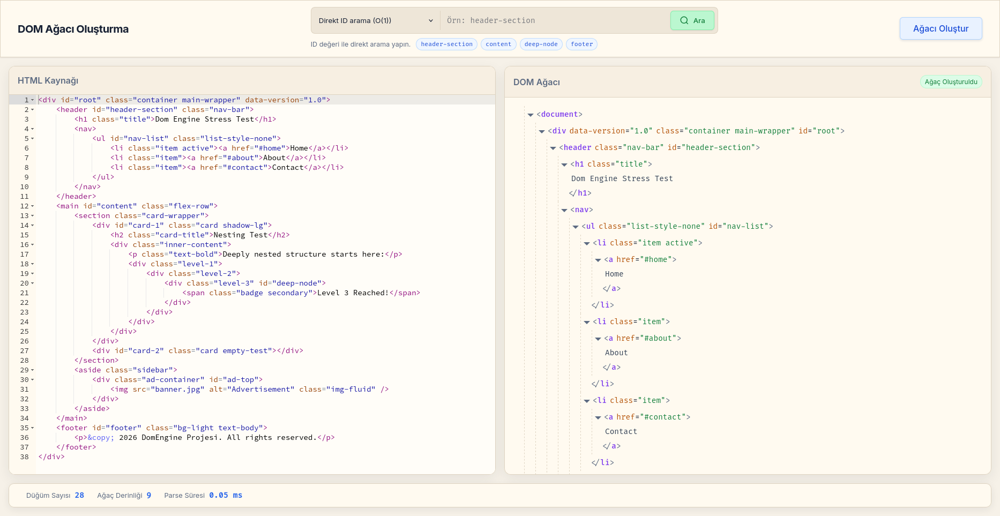
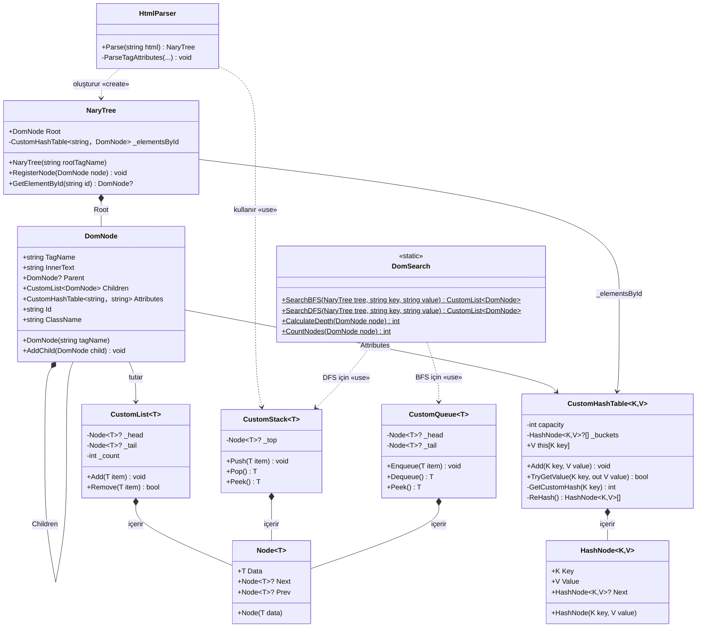

# Veri Yapıları ile HTML'den DOM Ağacı Oluşturma Projesi



Bu proje, bir HTML stringini parse ederek DOM ağacı yapısı oluşturur. Projemiz 3 bileşenden oluşmaktadır.

### 1. Core (Çekirdek) katmanı
C#'taki hazır koleksiyonlar (`List<>`, `Dictionary<>` vb.) yerine kullandığımız kendi yazdığımız veri yapılarını, ağaç yapısını ve parser mantığını içerir.

Çekirdek katmanı .NET 8 ile yazılmıştır. Hiçbir dış kütüphane kullanmamaktadır.

### 2. API katmanı
Çekirdek ile web katmanının arasındaki iletişimi sağlar. Frontend'den gelen HTML stringini çekirdekteki parser'ı kullanarak ayrıştırır. Sonuçları HTTP üzerinden JSON formatında geri döndürür.

API katmanı .NET 8 Web API kullanmaktadır.

### 3. Web katmanı
Kullanıcının projeyle etkileşime geçeceği katmandır. Kullanıcı bir HTML stringi gönderip bu HTML'den oluşturulan DOM ağacını görebilir, bu ağaç üzerinde arama yapabilir.

## Oluşturduğumuz Veri Yapıları
Projemizde C#'ın hazır veri yapıları yerine kendi veri yapılarımızı oluşturup kullandık. Detaylarını aşağıda görebilirsiniz.

### 1. Ağaç yapısı (DomNode ve NaryTree)
- **DomNode**: Ağaçtaki en küçük birimdir. Her bir node bir HTML dokümanındaki en küçük birim olan HTML elementlerini temsil eder. İçerisinde elementin adı, içindeki metni, bir üst seviyedeki elementi ve sahip olduğu attribute'ları barındıran tutan özel bir hash table barındırır. Altındaki diğer HTML elementlerini de bir CustomList içinde saklar.

- **NaryTree**: Ağacın kendisidir. Ağaç içindeki hiyerarşiyi yönetir. Altına sınırsız sayıda node alabilen kök düğümü (root) tutar.
Bir N-ary tree'de her düğümün N adet alt düğümü (çocuğu) olabilir. Ayrıca içinde `id` ile hızlı aramalar yapmak için bir hash table barındırır.

### 2. Dinamik dizi (CustomList)
C#'taki standart liste yapısının elle yazılmış bir muadilidir. Çift yönlü bir bağlı liste mantığıyla oluşturulmuştur. Indexer yapısı sayesinde dinamik dizi gibi çalışır.

DOM node'larının alt node'larını listelemek ve arama sonuçlarını saklamak için kullanılır. Listeye eleman ekleme veya indeksten eleman getirme işlemlerini yönetir.

### 3. Hash Table (CustomHashTable)
Elementlere hızlı erişebilmemiz için Key-Value (Anahtar-Değer) şeklinde saklayan veri yapısıdır. Projede iki farklı yerde kullanılır:

1. **ID İndeksi**: Ağaca eklenen ve bir ID'si olan her bir düğümü, id'yi anahtar (key) ve düğümün kendisini değer (value) olarak alıp hash table içinde indeksler. Aranan id'nin hash değeri hesaplanıp doğrudan ID'nin bulunduğu bucketa gidildiği için, ağaçta milyar tane bile düğüm olsa aradığımız düğüm O(1) zamanda yani neredeyse anında bulunur.
2. **Element Attribute'ları:** Her bir DOM düğümü kendi HTML attribute'larını (Örn: `class="container"`) hash table yapısı içinde tutar. Bu sayede bir düğümün class'ı veya href'i sorgulandığında neredeyse O(1) sürede bulunur.

**Çakışma Çözümü ve Performans:**
Hash Table, hash çakışmalarını çözmek için **Zincirleme (Separate Chaining)** yöntemini kullanır. Yani aynı indekse düşen elemanlar `HashNode` kullanılarak tek yönlü bağlı liste kullanılarak birbirine bağlanır. 

Hashleme fonksiyonu, aşağıdaki formülü kullanarak şifreleme yapar:

```cs
foreach (char c in strKey)
{
    hash = (hash * 17) + c;
}
```

Kullandığımız formül, kelimelerin harf değerlerini hesaplarken her aşamada şu ana kadar olan sayıların toplamını 17 gibi bir asal sayıyla çarpar.

Bu işlem, "ali" ve "ila" gibi anagram kelimelerin aynı hash değerini üreterek çakışmasını engelleyerek verilerin tabloya eşit dağılmasını sağlar. Tablonun doluluk oranı %75'i geçtiğinde, dizi boyutu iki katına çıkarıp tekrar hashleyerek hep O(1)'e yakın bir performans vermesini sağlar.

### 4. Stack (yığın) yapısı: (CustomStack)
LIFO (Son Giren İlk Çıkar) prensibiyle çalışan veri yapısıdır.

- **Parser'daki kullanımı**: HTML parse edilirken açılış etiketleri `<tag>` stack'e atılır (Push edilir). Kapanış etiketi `</tag>` geldiğinde stack'in en üstündeki elemanla eşleşip eşleşmediği kontrol edilerek çıkartılır (Pop). Bu sayede HTML etiketlerinin düzgün kapanıp kapanmadığı kontrol edilir.
- **DFS'teki kullanımı**: Derinlik Öncelikli Arama (DFS) algoritması çalıştırılırken, gidilen yol stack'te tutularak ağacın en dibine (yapraklarına) kadar inilmesi sağlanır.

### 5. Queue (kuyruk): (CustomQueue)
FIFO (İlk Giren İlk Çıkar) prensibiyle çalışır.
- **BFS'teki kullanımı**: BFS algoritmasında, ağaç seviyelerini sırasıyla dolaşmak amacıyla kullanılmıştır. Düğümler kuyruğa alınır ve sırası gelenin çocukları (alt elementleri) tekrar kuyruğun sonuna eklenir.

### Parser motoru
HTML'i karakter karakter okuyarak token'lara ayıran bir Lexical Analyzer mantığıyla çalışır.

Metni baştan sonra tararken `<` gördüğünde bir etiketin başlangıcı olduğunu algılayıp işaretler. Etiketin içinde `=` gördüğünde attribute olduğunu algılayıp işler.

Kendi yazdığımız `CustomStack` yapısını kullanarak etiketleri ebeveyn-çocuk ilişkisiyle birbirine bağlar ve sonuç olarak bir `NaryTree` ağacı oluşturur.

## Çalıştırma
Projeyi hızlı bir şekilde çalıştırmak için Docker kullanabilirsiniz.

Projenin ana klasöründe bir Docker Compose dosyası bulunmaktadır. Aşağıdaki komutla hem frontend hem de backend projelerini aynı anda çalıştırabilirsiniz.

```bash
docker compose up -d --build
```

Proje derlendikten sonra [localhost:3000](http://localhost:3000) üzerinden arayüze ulaşabilirsiniz.

## UML Sınıf Diyagramı



## Multiplicity (Çokluk) Tablosu

| İlişki Türü | Kaynak Sınıf | Hedef Sınıf | Çokluk | Açıklama |
|-------------|-------------|------------|--------|----------|
| Composition | `CustomList<T>` | `Node<T>` | 1 → 0..* | Liste sıfır veya daha fazla düğüm içerir |
| Composition | `CustomStack<T>` | `Node<T>` | 1 → 0..* | Stack sıfır veya daha fazla düğüm içerir |
| Composition | `CustomQueue<T>` | `Node<T>` | 1 → 0..* | Queue sıfır veya daha fazla düğüm içerir |
| Composition | `CustomHashTable<K,V>` | `HashNode<K,V>` | 1 → 0..* | Hash table sıfır veya daha fazla hash düğümü içerir |
| Composition | `NaryTree` | `DomNode` | 1 → 1 | Her ağacın tam olarak bir kök düğümü vardır |
| Composition | `DomNode` | `DomNode` | 1 → 0..* | Bir düğüm sıfır veya daha fazla çocuğa sahip olabilir |
| Association | `DomNode` | `DomNode` | 0..* → 0..1 | Her çocuğun en fazla bir ebeveyni vardır (Parent) |
| Association | `DomNode` | `CustomHashTable<string,string>` | 1 → 1 | Her düğümün bir attribute tablosu vardır |
| Association | `NaryTree` | `CustomHashTable<string,DomNode>` | 1 → 1 | Ağacın bir ID indeks tablosu vardır |
| Realization | `CustomList<T>` | `IEnumerable<T>` | - | Interface implementasyonu |
| Generalization | `ParserController` | `ControllerBase` | - | Kalıtım (Inheritance) |

## Algoritma Analizi

### 1. ID ile Arama (Hash Table)
DOM üzerindeki bir elemanı `id` değerine göre bulma işlemidir.
- **Zaman Karmaşıklığı:** O(1)
  - Hash Table kullandığımız için elemanın yerini index hesabı ile doğrudan, tek işlemde buluruz.
- **Uzay Karmaşıklığı:** O(N)
  - Sadece `id` niteliğine sahip olan elemanları Hash Table'a kaydettiğimiz için O(N) kadar hafıza kullanırız.

### 2. Derinlik Öncelikli Arama (DFS)
Ağaç üzerinde dal dal (aşağı doğru) inerek yapılan arama işlemidir. (Örn: Class veya Tag ararken)
- **Zaman Karmaşıklığı:** O(N)
  - En kötü ihtimalle ağaçtaki bütün düğümleri (N tane) tek tek kontrol etmemiz gerekir.
- **Uzay Karmaşıklığı:** O(N)
  - Rekürsif (kendi kendini çağıran) bir fonksiyon olduğu için ağacın maksimum derinliği (N) kadar hafıza kullanır.

### 3. Genişlik Öncelikli Arama (BFS)
Ağaç üzerinde katman katman (yatay olarak) yapılan arama işlemidir. Kuyruk (Queue) yapısı ile çalışır.
- **Zaman Karmaşıklığı:** O(N)
  - DFS gibi, en kötü ihtimalle bütün düğümleri (N tane) kontrol etmemiz gerekir.
- **Uzay Karmaşıklığı:** O(N)
  - O anki katmandaki elemanları sıraya (kuyruğa) aldığı için, ağacın en geniş katmanındaki eleman sayısı (N) kadar hafıza kullanır.

---

### BFS ve DFS karşılaştırması


## Algoritma Karmaşıklık Özeti

| Algoritma | Zaman | Uzay | Kullandığı Yapı |
|-----------|-------|------|-----------------|
| BFS | O(N) | O(N) (N: en geniş seviye) | `CustomQueue<T>` |
| DFS | O(N) | O(N) (N: ağaç derinliği) | `CustomStack<T>` |
| ID ile arama | O(1) | O(1) | `CustomHashTable<K,V>` |

## Lisans
Proje MIT lisansı altında lisanslanmıştır.

## Hazırlayanlar
- Ahmet Arda Varak
- Yağızhan Burak Yakar
- Mustafa Eren Çetin
- Yusuf Pehlivan
- Yusuf Kahraman