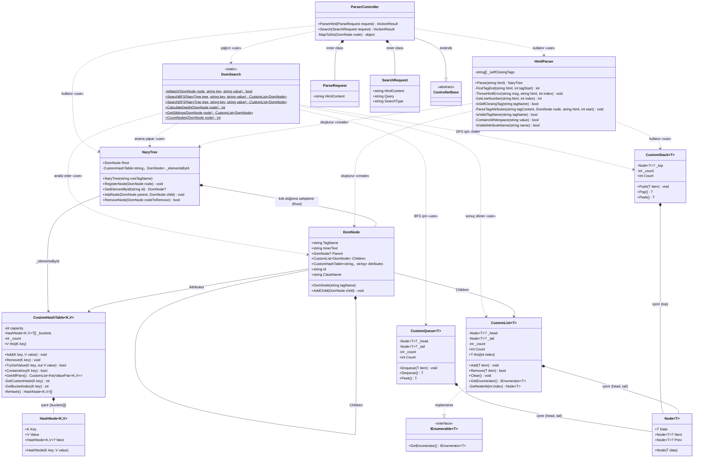
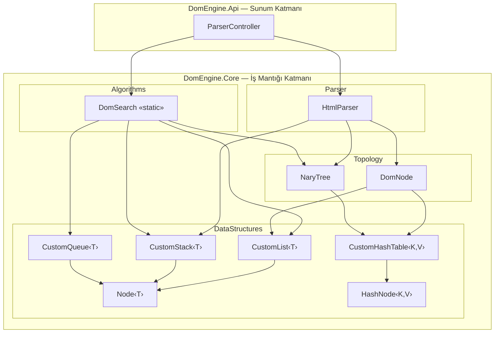

# DomEngine — UML Sınıf Diyagramı (Class Diagram)

> Bu diyagram, UML 2.0 standartlarına uygun olarak hazırlanmıştır. Tüm sınıflar, alanlar (attributes), metotlar (operations), erişim belirteçleri (visibility), generic tipler ve sınıflar arası ilişkiler (association, composition, dependency, realization) akademik notasyona sadık kalınarak gösterilmiştir.

---

## Sınıf Diyagramı

---

## Notasyon Kılavuzu (Legend)

| Sembol | Anlamı | UML Terimi |
|--------|--------|------------|
| `+` | Public erişim | Public visibility |
| `-` | Private erişim | Private visibility |
| `$` (metot sonrası) | Static metot | Static operation |
| `<<static>>` | Statik sınıf stereotipi | Stereotype |
| `<<interface>>` | Arayüz stereotipi | Stereotype |
| `<<abstract>>` | Soyut sınıf stereotipi | Stereotype |
| `~T~` | Generic tip parametresi | Template parameter |
| `◆ (*--)` | **Composition** — Parça, bütün olmadan yaşayamaz | Filled diamond |
| `→ (-->)` | **Association** — Kalıcı referans ilişkisi | Directed association |
| `⇢ (..>)` | **Dependency** — Geçici kullanım bağımlılığı | Dashed arrow |
| `⇢▷ (..\|>)` | **Realization** — Interface implementasyonu | Dashed triangle |
| `→▷ (--\|>)` | **Generalization** — Kalıtım (Inheritance) | Solid triangle |

---

## Paket (Package) Organizasyonu

---

## Multiplicity (Çokluk) Tablosu

| İlişki Türü | Kaynak Sınıf | Hedef Sınıf | Çokluk | Açıklama |
|-------------|-------------|------------|--------|----------|
| Composition | `CustomList<T>` | `Node<T>` | 1 → 0..* | Liste sıfır veya daha fazla düğüm içerir |
| Composition | `CustomStack<T>` | `Node<T>` | 1 → 0..* | Stack sıfır veya daha fazla düğüm içerir |
| Composition | `CustomQueue<T>` | `Node<T>` | 1 → 0..* | Queue sıfır veya daha fazla düğüm içerir |
| Composition | `CustomHashTable<K,V>` | `HashNode<K,V>` | 1 → 0..* | Hash table sıfır veya daha fazla hash düğümü içerir |
| Composition | `NaryTree` | `DomNode` | 1 → 1 | Her ağacın tam olarak bir kök düğümü vardır |
| Composition | `DomNode` | `DomNode` | 1 → 0..* | Bir düğüm sıfır veya daha fazla çocuğa sahip olabilir |
| Association | `DomNode` | `DomNode` | 0..* → 0..1 | Her çocuğun en fazla bir ebeveyni vardır (Parent) |
| Association | `DomNode` | `CustomHashTable<string,string>` | 1 → 1 | Her düğümün bir attribute tablosu vardır |
| Association | `NaryTree` | `CustomHashTable<string,DomNode>` | 1 → 1 | Ağacın bir ID indeks tablosu vardır |
| Realization | `CustomList<T>` | `IEnumerable<T>` | — | Interface implementasyonu |
| Generalization | `ParserController` | `ControllerBase` | — | Kalıtım (Inheritance) |

---

## Veri Yapısı Karmaşıklık Özeti (Big-O)

| Veri Yapısı | Ekleme | Silme | Arama | Erişim (Index) | Kullanım Amacı |
|-------------|--------|-------|-------|----------------|----------------|
| `CustomList<T>` (Doubly Linked List) | O(1) sona | O(n) | O(n) | O(n) | DomNode çocuk listesi, sonuç listesi |
| `CustomStack<T>` (LIFO) | O(1) | O(1) | — | — | HTML parser tag eşleşme, DFS traversal |
| `CustomQueue<T>` (FIFO) | O(1) | O(1) | — | — | BFS traversal |
| `CustomHashTable<K,V>` (Chaining) | O(1) ort. | O(1) ort. | O(1) ort. | — | Attribute saklama, ID ile O(1) erişim |
| `Node<T>` (Doubly Linked) | — | — | — | — | CustomList, CustomStack, CustomQueue temel yapı taşı |
| `HashNode<K,V>` (Singly Linked) | — | — | — | — | CustomHashTable zincirleme (chaining) düğümü |

---

## Algoritma Karmaşıklık Özeti

| Algoritma | Zaman | Uzay | Kullandığı Yapı |
|-----------|-------|------|-----------------|
| BFS (SearchBFS) | O(N) | O(W) — W: en geniş seviye | `CustomQueue<T>` |
| DFS (SearchDFS) | O(N) | O(D) — D: ağaç derinliği | `CustomStack<T>` |
| GetElementById | O(1) | O(1) | `CustomHashTable<K,V>` |
| CalculateDepth | O(N) | O(D) — rekürsiyon yığını | Rekürsiyon |
| CountNodes | O(N) | O(D) — rekürsiyon yığını | Rekürsiyon |
| GetSiblings | O(K) — K: kardeş sayısı | O(K) | `CustomList<T>` |
