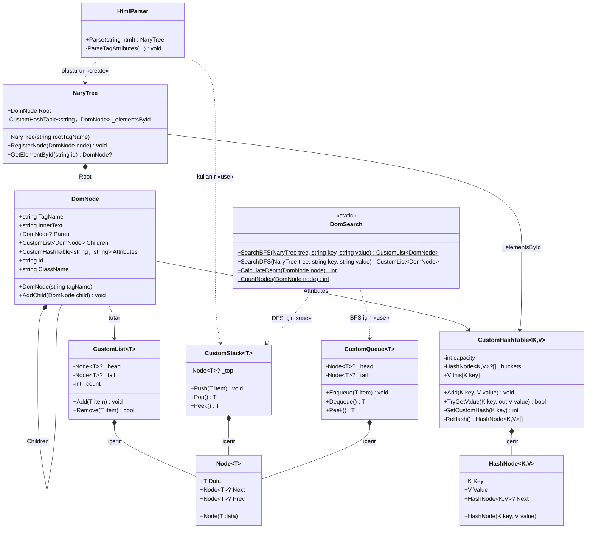

# Proje Raporu: Veri Yapıları ile HTML'den DOM Ağacı Oluşturma

## 1. Proje Özeti ve Amacı

Bu projenin temel amacı, dışarıdan veya herhangi bir kaynaktan alınan ham HTML (HyperText Markup Language) metinlerinin, yerleşik (built-in) dil kütüphanelerine veya hazır koleksiyonlara bağımlı kalmadan, baştan sona sıfırdan tasarlanmış veri yapıları kullanılarak parse edilmesi ve bellekte bir **Belge Nesne Modeli (DOM - Document Object Model)** ağacına dönüştürülmesidir. 

Projenin eğitsel odak noktası; `.NET` (C#) ekosistemindeki `List<>`, `Dictionary<>`, `Stack<>` veya `Queue<>` gibi hazır koleksiyonların çalışma prensiplerini kavramak ve bu yapıları akademik bir yaklaşımla, alt seviyeden kendi başımıza inşa etmektir. Hazırlanan bu özel koleksiyonlar, HTML metninin tokenlara (etiket, nitelik, içerik) ayrılması, mantıksal ağaç yapısının kurulması ve üzerinde gelişmiş arama (BFS, DFS) algoritmalarının koşturulması işlemlerinde aktif rol oynamaktadır.

## 2. Projenin Çalışma Mantığı ve Kullanılan Yapıların Gösterimi

Proje modern yazılım prensiplerine uygun olarak **3 Katmanlı Mimari** etrafında şekillendirilmiştir:

1. **DomEngine.Core (Çekirdek Katmanı):**
   Projenin kalbini oluşturur. Tüm özel veri yapıları (List, Stack, Queue, HashTable), ağaç topolojisi (NaryTree, DomNode), metin ayrıştırma motoru (HtmlParser) ve arama algoritmaları (DomSearch) bu katmanda yer alır. Hiçbir dış kütüphaneye veya sunum mantığına bağımlılığı yoktur.

2. **DomEngine.Api (API Katmanı):**
   Core katmanında işlenen verileri ve DOM ağacını dış dünyaya açan `.NET 8 Web API` katmanıdır. Frontend'den gelen ham HTML metnini alır, Core motorunda ayrıştırır ve sonucu JSON formatında HTTP üzerinden geri döndürür.

3. **DomEngine.Web (Frontend Katmanı):**
   Kullanıcının HTML metnini girebileceği ve oluşturulan DOM ağacını görsel olarak inceleyebileceği arayüzdür. AJAX kullanılarak asenkron olarak arka uçtaki API ile iletişim kurar ve oluşturulan ağaç hiyerarşisini ekrana yansıtır.

## 3. Yapıların Detaylı Anlatımı

Hazır koleksiyonlar yerine projede özel olarak tasarlanmış veri yapıları kullanılmıştır. Her bir yapının çalışma mekanizması ve projede kullanım senaryosu aşağıda detaylandırılmıştır:

### 3.1. Ağaç Topolojisi: `DomNode` ve `NaryTree`
- **DomNode:** DOM ağacının en küçük yapıtaşıdır. Her bir `DomNode`, bir HTML etiketini (örn: `<div>`, `<p>`) temsil eder. İçerisinde etiketin adını (`TagName`), etiket içindeki metni (`InnerText`), ebeveyn düğüm referansını (`Parent`) ve sahip olduğu nitelikleri tutan özel `CustomHashTable` nesnesini barındırır. Alt düğümleri (çocukları) ise `CustomList<DomNode>` içerisinde saklanır.
- **NaryTree:** Ağacın kendisidir ve hiyerarşiyi yönetir. Sınırsız alt çocuk düğüm destekleyen asıl ağaç yapısını kurarak Kök düğümü (`Root`) tutar. N-Ağacı (N-ary Tree) mantığıyla her düğümün "N" adet çocuğu olabilir. Ayrıca içinde `id` bazlı hızlı aramalar yapmak için özel bir `CustomHashTable` barındırır.

### 3.2. Dinamik Dizi: `CustomList<T>`
C#'taki standart `List<T>` sınıfının bir muadilidir. Çift Yönlü Bağlı Liste (Doubly Linked List) veya Dinamik Dizi mantığıyla kurgulanmıştır. DOM düğümlerinin çocuklarını (`Children`) listelemek ve arama sonuçlarını saklamak için yoğun olarak kullanılır. Başa, sona eleman ekleme veya indeksten eleman getirme işlemlerini yönetir.

### 3.3. Hash Tablosu: `CustomHashTable<K,V>`
Anahtar-değer (Key-Value) eşleşmelerini saklayan veri yapısıdır. Projede özellikle iki farklı yerde, O(1) zaman karmaşıklığı elde etmek için kritik rol oynar:

1. **NaryTree İçerisindeki ID İndeksi (`_elementsById`):** NaryTree, ağaca eklenen ve `id` niteliğine sahip olan her düğümü, id'yi anahtar (key) ve düğümün kendisini değer (value) olarak alıp `CustomHashTable<string, DomNode>` içinde indeksler. `GetElementById` fonksiyonu çağrıldığında ağacı (DFS veya BFS ile) baştan aşağı taramak O(N) zaman alır. Oysa Hash Table kullanıldığında; aranan id'nin hash değeri hesaplanıp doğrudan bellekteki adrese (bucketa) gidildiği için, ağaçta milyonlarca düğüm olsa dahi hedef düğüm **O(1) amorte edilmiş zamanda (anında)** bulunur.
2. **DomNode İçerisindeki Nitelikler (Attributes):** Her bir DOM düğümü kendi HTML niteliklerini (Örn: `class="container"`, `href="#"`) `CustomHashTable<string, string>` yapısı içinde tutar. Bu sayede bir düğmenin class'ı veya href'i sorgulandığında ağaç üzerindeki O(1) erişim hızı nitelik bazında da sağlanmış olur.

**Çakışma (Collision) Çözümü ve Performans:**
Hash Table, hash çakışmalarını çözmek için **Zincirleme (Separate Chaining)** yöntemini kullanır. Yani aynı indekse düşen elemanlar `HashNode` isimli tek yönlü bağlı liste (Singly Linked List) kullanılarak birbirine bağlanır. 
Hash fonksiyonu (`GetCustomHash`), kelimelerin harf değerlerini hesaplarken önceki toplamı 17 gibi bir asal sayıyla çarpar. Bu işlem, "Ali" ve "ila" gibi anagram kelimelerin aynı hash değerini (çakışmayı) üretmesini engelleyerek verilerin tabloya eşit dağılmasını sağlar. Tablonun doluluk oranı %75'i geçtiğinde, dizi boyutu iki katına çıkarılarak (ReHash) O(1) performansı her zaman garanti altına alınır.

### 3.4. Yığın (LIFO): `CustomStack<T>`
Son Giren İlk Çıkar (Last-In-First-Out) prensibiyle çalışan veri yapısıdır. 
- **Kullanım Alanı 1 (HtmlParser):** HTML metni parse edilirken açılış etiketleri `<tag>` yığına atılır (Push). Kapanış etiketi `</tag>` geldiğinde yığının en üstündeki elemanla eşleşip eşleşmediği kontrol edilerek çıkartılır (Pop). Bu sayede HTML etiketlerinin hiyerarşik doğruluğu kontrol edilir.
- **Kullanım Alanı 2 (DomSearch DFS):** Derinlik Öncelikli Arama (DFS) algoritması çalıştırılırken, gidilen yol yığında tutularak ağacın en dibine (yapraklarına) kadar inilmesi sağlanır.

### 3.5. Kuyruk (FIFO): `CustomQueue<T>`
İlk Giren İlk Çıkar (First-In-First-Out) prensibiyle çalışır.
- **Kullanım Alanı:** `DomSearch` sınıfındaki Genişlik Öncelikli Arama (BFS - Breadth First Search) algoritmasında, ağaç seviyelerini sırasıyla dolaşmak (Level-order traversal) amacıyla kullanılmıştır. Düğümler kuyruğa alınır ve sırası gelenin çocukları tekrar kuyruğun sonuna eklenir.

### 3.6. `HtmlParser` Ayrıştırıcı Motoru
HTML metnini karakter karakter okuyarak token'lara (işaretçilere) ayıran Lexical Analyzer (Sözcük Analizcisi) mantığıyla çalışır. Metni baştan sona tarar; `<` gördüğünde etiket başlangıcı olarak işaretler, `=` gördüğünde nitelik ataması (attribute assignment) yapar. Özel yazdığımız `CustomStack` yapısını kullanarak kendi kendini kapatmayan etiketleri bellekte ebeveyn-çocuk ilişkisiyle (Tree Topology) birbirine bağlar ve sonuç olarak tam teşekküllü bir `NaryTree` döndürür.

### 3.7. `DomSearch` Arama Algoritmaları
Ağaç (DOM) üzerinde istenilen bir etiketi (tag), sınıfı (class) veya herhangi bir niteliği (attribute) bulmak için oluşturulmuş arama motorudur. Aramanın derinliğine veya genişliğine göre bellek/zaman optimizasyonu sağlayabilmek için iki farklı algoritma ile tasarlanmıştır:
- **Genişlik Öncelikli Arama (BFS):** Hedef eleman ağacın kök (üst) katmanlarına yakın olduğunda tercih edilir. Tüm çocukları yatay seviyede, katman katman `CustomQueue` yardımıyla dolaşır.
- **Derinlik Öncelikli Arama (DFS):** Hedef eleman ağacın çok derinlerinde (örneğin içiçe geçmiş çok sayıda `div`'in en altındaysa) tercih edilir. Dallar `CustomStack` yardımıyla en uca (yapraklara) kadar takip edilir ve ancak yol bittiğinde geri dönülür (Backtracking).

Böylece kullanıcı veya API üzerinden gelen isteğin tipine göre, bellek (RAM) tüketimi kontrol altında tutularak en verimli arama gerçekleştirilir.

## 4. UML Diyagramı ve Algoritma Analizi

Bu bölümde, projedeki sınıfların ilişkileri UML standartlarına uygun olarak modellenmiş ve kullanılan arama algoritmalarının Zaman/Uzay karmaşıklıkları incelenmiştir.

### 4.1. UML Sınıf Diyagramı (Class Diagram)



### 4.2. Algoritma ve Zaman Karmaşıklığı Analizi (Big-O Notasyonu)

Ağaç üzerinde yapılan arama işlemleri (`DomSearch`), yapının ne kadar derine ve genişliğe sahip olduğuna göre iki farklı algoritma kullanılarak incelenmiştir. Toplam düğüm sayısı $N$, ağacın derinliği $D$, en geniş seviyedeki düğüm sayısı $W$ olsun:

- **1. ID ile Arama (`GetElementById`):**
  DOM üzerindeki bir elemanı `id` değerine göre bulma işlemidir.
  - **Zaman Karmaşıklığı:** O(1)
    - Ağaçta tek tek dolaşmak yerine, `NaryTree` içindeki Hash Table kullanılır. Elemanın yerini dizin (index) hesabı ile doğrudan, tek işlemde buluruz.
  - **Uzay Karmaşıklığı:** O(M)
    - Sadece `id` niteliğine sahip olan (M tane) elemanları Hash Table'a kaydettiğimiz için O(M) kadar hafıza kullanırız.

- **2. Derinlik Öncelikli Arama (DFS):**
  Ağaç üzerinde dal dal (aşağı doğru) inerek yapılan arama işlemidir. Yığın (Stack) kullanılır.
  - **Zaman Karmaşıklığı:** O(N)
    - En kötü ihtimalle (örneğin istenen sınıf/etiket ağacın en altındaki son daldaysa) ağaçtaki bütün düğümleri tek tek kontrol etmemiz gerekir.
  - **Uzay Karmaşıklığı:** O(D)
    - Stack'te sadece kökten yaprağa kadar olan yol tutulduğu için, ağacın derinliği (D) kadar hafıza harcar. Bellek açısından daha tasarrufludur.

- **3. Sığlık Öncelikli Arama (BFS):**
  Ağaç üzerinde katman katman (yatay olarak) yapılan arama işlemidir. Kuyruk (Queue) yapısı ile çalışır.
  - **Zaman Karmaşıklığı:** O(N)
    - Tıpkı DFS gibi, en kötü ihtimalle bütün düğümleri (N tane) kontrol etmemiz gerekir.
  - **Uzay Karmaşıklığı:** O(W)
    - O anki katmandaki elemanları sıraya (kuyruğa) aldığı için, ağacın en geniş katmanındaki eleman sayısı (W) kadar hafıza kullanır. Derin ama dar ağaçlarda çok verimli, ancak geniş ağaçlarda yüksek RAM tüketimine sebep olur.

- **Rekürsif Ağaç Analizleri (Derinlik, Düğüm Sayısı):**
  - `CalculateDepth` ve `CountNodes` gibi algoritmalarda her düğüm bir defa ziyaret edilir (Zaman: O(N)). Fonksiyonlar rekürsif olduğu için çağrı yığını (call stack) ağacın derinliği kadar dolar (Uzay: O(D)).

## 5. Dockerizing ve Projeyi Çalıştırma

Proje hem API hem de Frontend katmanlarını barındırdığından, hızlı kurulum ve platform bağımsızlık sağlamak amacıyla konteyner mimarisi (Docker) ile paketlenmiştir. Projeyi ayağa kaldırmak için bilgisayarınızda Docker yüklü olmalıdır.

**Adımlar:**
1. Projenin ana dizinine (Docker Compose dosyasının bulunduğu yer) terminal/komut satırı ile gidin.
2. Tüm servisleri (API ve Web) derleyip başlatmak için aşağıdaki komutu çalıştırın:
   ```bash
   docker compose up -d --build
   ```
3. İmajların oluşturulması ve konteynerlerin ayağa kalkması birkaç saniye sürebilir. İşlem tamamlandıktan sonra web tarayıcınızdan arayüze erişebilirsiniz:
   - **Adres:** [http://localhost:3000](http://localhost:3000)

Sistemi durdurmak için `docker compose down` komutunu kullanabilirsiniz.
